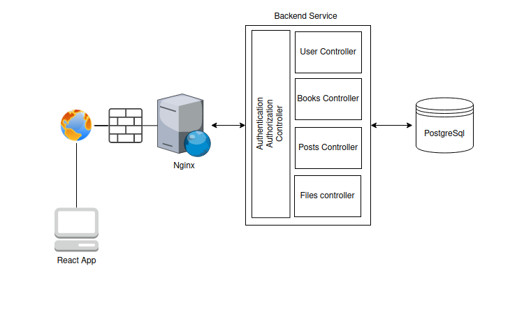
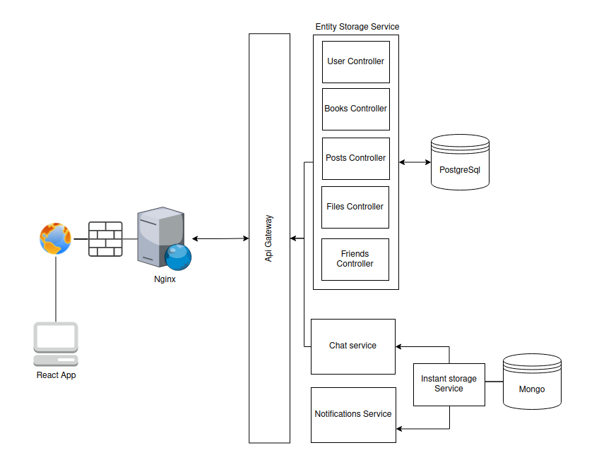

# Librarian

This is a web application in which you can publush all the books you have, write a little review and update your progress.

## Overview
This page was made with learning purposes. In this development process the following concepts were covered:

- Authentication/Authorization

- REST Full API

- Password Restorement through Email

- Session management

- Server Side File Storage 

- CRUD

- User management

- Database management through ORM

- Client side rendering

- Reverse proxy

- Dynamic DNS

- SSL certificates

## Technologies

General:

### [Frontend](./librarian-front/)

### [Backend](./librarian-back/)

## Architecture

### Current Architecture

The current architecture is pretty simple, it consist of a monolitic backend in charge of process the Client requests.

The backend is a REST Full API that handle the user sessions by JWT tokens.

The server runs in a port with low privileges and is protected by a firewall. All the trafic to it is fordwarded from an Nginx server running in the 443 port. This way it's assured security gaps in our application won't compromise the server.

All the information travels from the internet to Nginx encrypted. The connection uses SSL certificate autoadministrated with Certbot.

### Future Architecture

The future architecture is a Microservice implementation in which new features will be added, like the posibility to add friends, comment their content and communicate with them by using an instant chat. 

It is planned to have three micro-services, one for the entities storage and two others in charge of the real time communication processes like chat and notifications.

Those microservices won't be exposed to the public, a new service called Api Gateway will be created instead. It will be in charge of orchestrating, authenticating and authorizing the users and due to its fast response times, it was decided to use Mongo DB for those real time communication services.

## Raise the project Locally

Download the project 

    git clone https://github.com/angellovc/librarian

### Setting the backend
Go to back-end folder
    cd librarian-back

And type in the following commands

    npm install
    PORT=3000 npm start

It will tell the npm package manager to install the necessary dependencies to run the project and will start a backend server running in the port 3000.

### Setting the front
Go to front end folder

    cd librarian-front

and type in

    npm install
    npm run build

It will create a production version of our frontend project in the build folder. Use the application you please to serve the files there.

