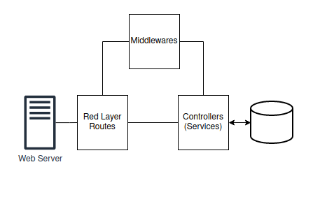

# Librarian Backend
The structure of the project is pretty straightforward it consists of a middlewares folder, a router and a service folder.

## [Routes](./routes/)

The routes folder is where all endpoints of our program are located. It is also called the Red layer and is in charge of calling the controllers (services) and the middlewares.

## [Services](./services/)

This folder is where the controllers of our program are located. Here you can find all the classes that contains the logic of our application. They are the ones able to consult the Database and define the rules to affect its information.

## [Models](./models/)

It contain the abstractions of the entities in the database. They let the programmer handle the database in a Typescript format. This models are used by the services to load and manage the information that goes to or comes from the Database.

## [Middlewares](./middlewares/)

It refers to functions that goes in the middle of the Red layer (Routes) and the controller layer (Service). These functions are usually used to catch errors or to perform some validations or transformation over the shared information before letting the controller access the Data.

